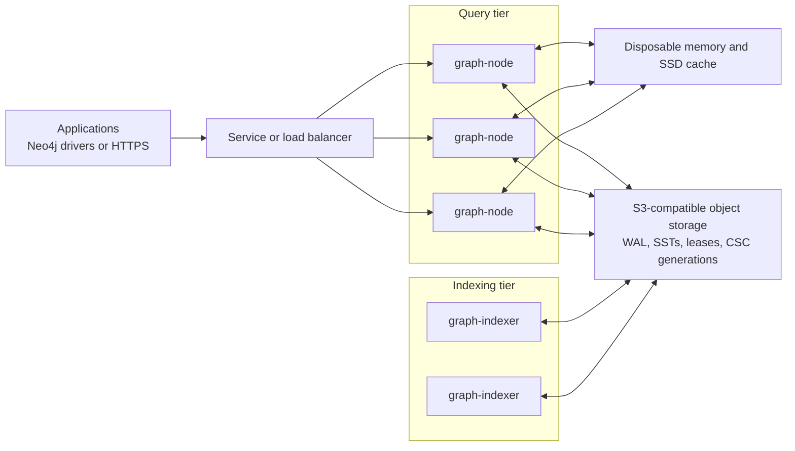

# Turbolay

[](https://github.com/usecortex/turbolay2/actions/workflows/ci.yml)
[](https://github.com/usecortex/turbolay2/actions/workflows/opencypher-tck.yml)
[](LICENSE)
[](rust-toolchain.toml)

Turbolay is an object-store-native distributed graph database written in Rust.
It combines durable graph storage on SlateDB with snapshot-consistent
OpenCypher queries, GraphBLAS traversal, Neo4j-compatible Bolt connectivity,
and an HTTPS query API.

S3-compatible object storage is the durable source of truth. Query nodes and
indexers keep only disposable state in memory and on local SSD or NVMe, so they
can be replaced or scaled without moving the graph itself.

## Why Turbolay

- **Object-store durability.** Graph records, WALs, manifests, and immutable
  traversal indexes live in S3-compatible storage.
- **Independent compute.** Query nodes and indexers scale separately and can
  rebuild their local caches from durable state.
- **Safe writer handoff.** Object-store CAS leases select the active writer for
  each cell, while SlateDB writer epochs fence stale writers.
- **Consistent reads.** Every query runs against one pinned SlateDB snapshot.
  Indexed traversal combines a compiled CSC generation with its visible WAL
  overlay.
- **Graph-native execution.** The planner uses property indexes, reverse
  adjacency, sparse traversal, and SuiteSparse GraphBLAS where appropriate.
- **Familiar clients.** Applications can use Neo4j drivers over Bolt 5.x or the
  typed JSON and streaming NDJSON HTTP API.
- **Bounded operation.** Authentication, authorization, deadlines, result
  limits, backpressure, cancellation, cache budgets, metrics, and traces are
  part of the server runtime.

## Architecture



Query nodes serve reads and canonical graph mutations. Indexer workers build
immutable CSC generations asynchronously and publish them through atomic
object-store pointers. Readers remain correct when an index is absent or behind
because the visible WAL tail is applied to the indexed base.

See [architecture.md](architecture.md) for the storage model, query pipeline,
writer coordination, index lifecycle, and failure semantics.

## Getting Started

### Prerequisites

Turbolay requires Rust 1.91 or newer, a C/C++ toolchain,
`libcypher-parser`, and SuiteSparse GraphBLAS.

Ubuntu or WSL:

```bash
sudo apt-get update
sudo apt-get install -y \
  build-essential clang libclang-dev cmake pkg-config \
  libcypher-parser-dev libgraphblas-dev
```

macOS with Homebrew:

```bash
xcode-select --install
brew install rustup-init just cmake pkg-config llvm suite-sparse
brew install cleishm/neo4j/libcypher-parser
rustup-init

export PKG_CONFIG_PATH="$(brew --prefix libcypher-parser)/lib/pkgconfig:${PKG_CONFIG_PATH:-}"
```

[`just`](https://github.com/casey/just) is the supported command runner for the
repository. Install it with `cargo install just --locked` when your package
manager does not provide it. Docker is optional and is used only by MinIO,
Neo4j comparison, image-build, and Kubernetes harnesses.

### Clone and verify

```bash
git clone https://github.com/usecortex/turbolay2.git
cd turbolay2

just native-check
just smoke
```

The smoke example creates a local graph, writes and deletes edges, runs a sparse
traversal, closes the database, reopens it, and verifies the durable result.
The recipe creates and removes an isolated local object-store directory. Use
`just smoke-graphblas` to pin the traversal kernel to SuiteSparse GraphBLAS.

To exercise the same flow against an ephemeral MinIO instance:

```bash
just minio-smoke
```

### Run a local server

The following starts a single plaintext development node backed by a local
directory. TLS is required by default in deployed environments; plaintext must
be enabled explicitly.

```bash
mkdir -p .turbolay/store .turbolay/cache
printf '%s\n' 'local-development-token-32-bytes' > .turbolay/auth-token

export CLOUD_PROVIDER=local
export LOCAL_PATH="$PWD/.turbolay/store"
export GRAPH_NAMESPACE=default
export GRAPH_ID=default
export GRAPH_CELL_ID=cell-0
export GRAPH_CELLS=cell-0
export GRAPH_NODE_ID=node-0
export GRAPH_BOLT_NODE_ADDRESSES=node-0=127.0.0.1:7687
export GRAPH_ADVERTISED_BOLT_ADDR=127.0.0.1:7687
export GRAPH_DATA_CACHE_DIR="$PWD/.turbolay/cache"
export GRAPH_AUTH_TOKEN_FILE="$PWD/.turbolay/auth-token"
export GRAPH_ALLOW_PLAINTEXT=true

cargo run --locked --features server-runtime --bin graph-node
```

The node listens on:

| Endpoint | Address | Purpose |
|---|---|---|
| Bolt | `127.0.0.1:7687` | Neo4j-driver-compatible queries |
| HTTP | `127.0.0.1:8443` | JSON and NDJSON query API |
| Admin | `127.0.0.1:9090` | readiness and Prometheus metrics |

In another terminal, write and read a small graph through HTTP:

```bash
TOKEN='local-development-token-32-bytes'

curl -sS http://127.0.0.1:8443/v1/graphs/default/query \
  -H "Authorization: Bearer $TOKEN" \
  -H 'X-Graph-Namespace: default' \
  -H 'Content-Type: application/json' \
  --data '{"cell_id":"cell-0","query":"CREATE (a {id: 1})-[:FOLLOWS]->(b {id: 2})"}'

curl -sS http://127.0.0.1:8443/v1/graphs/default/query \
  -H "Authorization: Bearer $TOKEN" \
  -H 'X-Graph-Namespace: default' \
  -H 'Content-Type: application/json' \
  --data '{"cell_id":"cell-0","query":"MATCH (a {id: 1})-[:FOLLOWS]->(b) RETURN b.id AS id"}'
```

For a scripted Bolt and HTTP round trip, install the Python Neo4j driver and
run:

```bash
python3 -m pip install neo4j
bash scripts/runtime_smoke.sh
```

## Querying

Turbolay supports a practical OpenCypher subset for graph reads and mutations,
including typed relationships, bounded variable-length paths, property and
label predicates, ordering, pagination, aggregation, `OPTIONAL MATCH`, `UNION`,
and batched `UNWIND` writes.

Applications can connect with a Neo4j driver using a routed URI:

```text
neo4j://127.0.0.1:7687
```

Use `neo4j+s://` with a publicly trusted certificate or `neo4j+ssc://` for a
self-signed development certificate. Direct `bolt://` node addresses are for
diagnostics and targeted failure tests; write-capable clustered clients should
use routing.

### Native path procedures

Turbolay includes native snapshot-scoped path procedures:

- `algo.SPpaths` finds bounded paths between one source and one target.
- `algo.SSpaths` finds bounded paths from one source.
- `algo.MSpaths` resolves many indexed source and target values and evaluates
  them together, avoiding client-side query fan-out.

```cypher
CALL algo.MSpaths({
  sourceLabel: 'Entity',
  sourceProperty: 'name',
  sourceValues: ['alpha', 'beta', 'gamma'],
  targetValues: ['alpha', 'beta', 'gamma'],
  pairwise: true,
  relTypes: ['RELATES'],
  relDirection: 'both',
  maxLen: 3,
  pathCount: 5,
  fairRelationshipVariants: true,
  resultLimit: 100
})
YIELD path
RETURN path
```

The procedures use one pinned storage snapshot, compiled GraphBLAS topology
when available, the visible WAL overlay, and bounded metadata hydration.

## Read Consistency

Turbolay exposes two read modes:

| Mode | Behavior |
|---|---|
| `causal` | Uses the node's current durable reader view and refreshes when a supplied bookmark requires a newer sequence. This is the default hot path. |
| `strong` | Refreshes the SlateDB reader from object storage before pinning the query snapshot. This pays the object-store freshness cost. |

HTTPS requests set `"consistency": "causal"` or `"strong"` in the request
body. Bolt clients set `consistency` in `RUN` metadata or
`turbolay.consistency` in transaction metadata.

## Kubernetes

The Helm chart deploys query nodes, indexer workers, services, cache volumes,
network policies, disruption budgets, TLS resources, authentication, and
optional Prometheus integration.

```bash
helm upgrade --install turbolay charts/turbolay \
  --namespace turbolay \
  --create-namespace \
  --values charts/turbolay/examples/values-eks.yaml \
  --atomic \
  --timeout 15m
```

Copy and edit the example values before deploying. Object-store credentials,
bucket names, image references, TLS, advertised Bolt addresses, and workload
identity are environment-specific. See the [Helm chart guide](charts/turbolay/README.md)
for configuration and rollout details.

## Observability

The public HTTP server exposes `GET /healthz`. The graph-node and indexer admin
servers expose:

```text
GET /readyz
GET /metrics
```

The runtime emits structured tracing fields for query fingerprints, access
paths, cache outcomes, consistency mode, scope, cell, storage sequence, and
planner decisions. Build with `--features server-runtime,otlp` or
`--features indexer-runtime,otlp` to export OpenTelemetry data.

Prometheus duration histograms have deliberately different units. Read
[docs/runbooks/duration-histograms.md](docs/runbooks/duration-histograms.md)
before building latency dashboards or alerts.

## Development

Run `just` or `just help` to list the command surface. Recipes use Bash and run
from the repository root. The full native suite requires `libcypher-parser` and
SuiteSparse GraphBLAS.

### Verification Recipes

| Recipe | Coverage |
|---|---|
| `just native-check` | Verifies that `cypher-parser` and GraphBLAS are discoverable |
| `just fmt`, `just fmt-check` | Formats Rust or checks formatting without modifying files |
| `just clippy` | Default-feature lint used by CI |
| `just clippy-chaos`, `just clippy-opencypher` | Chaos-harness and OpenCypher lint configurations |
| `just clippy-native`, `just clippy-client-protocols`, `just clippy-runtime` | Full native, public protocol, and production runtime lint configurations |
| `just check` | Checks every default-feature target |
| `just check-all-features` | Checks every target with every Cargo feature |
| `just check-client-api`, `just check-bolt-server` | Checks shared client code and standalone Bolt independently |
| `just check-examples`, `just check-examples-native`, `just check-examples-chaos` | Checks example targets under their supported feature sets |
| `just test [cargo test args]` | Runs default library tests and forwards optional arguments |
| `just test-opencypher`, `just test-native`, `just test-client-protocols`, `just test-chaos` | Runs the major library and public-protocol test matrices |
| `just test-server-runtime`, `just test-indexer`, `just test-node-otlp` | Runs graph-node, indexer, and OTLP binary tests |
| `just test-placement`, `just test-telemetry` | Lints and tests the two workspace crates |
| `just ci` | Runs the complete local CI-equivalent sequence; a clean feature-matrix run can take tens of minutes (25m 41s in the verification run for this README) |

`scripts/ci_local.sh` is a compatibility entry point that sets a shared Cargo
target directory and delegates to `just ci`, so the script and Justfile cannot
silently drift into different test matrices.

### Local Harnesses

| Recipe | What it runs | Output or side effect |
|---|---|---|
| `just smoke` | Isolated local object-store write, traversal, reopen, and verification | Temporary directory removed on exit |
| `just smoke-graphblas` | The same smoke flow with SuiteSparse selected explicitly | Temporary directory removed on exit |
| `just query-correctness` | Exact OpenCypher result checks | `bench-results/query_correctness.csv` and `.log` |
| `just query-bench` | Configurable cold, hot, and concurrent query benchmark | `bench-results/query_bench_full.csv` and `.log` by default |
| `just query-memory-profile` | Build/query memory matrix with runtime-selectable kernels | Results and logs under the configured benchmark directory |
| `just stress` | Multiprocess writes, restart recovery, compaction, GC, and verification | Temporary local stores removed on exit |
| `just fence` | Hard SlateDB writer-takeover proof | Temporary local stores removed on exit |

The benchmark recipes intentionally use production-sized defaults and can run
for a long time. Override their documented `GRAPH_QUERY_*` environment
variables for a small development sample.

### Docker And MinIO Harnesses

| Recipe | Purpose |
|---|---|
| `just minio-smoke` | Runs the object-store smoke flow against an ephemeral MinIO container |
| `just minio-query-correctness` | Runs exact query checks against MinIO |
| `just minio-query-bench` | Runs the query benchmark against MinIO |
| `just minio-chaos` | Pauses, restarts, and recovers MinIO during graph operations |
| `just minio-fence` | Runs writer takeover against MinIO |
| `just minio-mbt` | Replays the formal MBT adapters against MinIO; unavailable in this checkout because the referenced `tests/formal_mbt*.rs` targets are absent |

The MinIO recipes create isolated containers, networks, buckets, and temporary
configuration files. Their cleanup traps remove those resources unless a
recipe-specific keep flag is set. Docker may pull pinned images on the first
run.

### Standalone Scripts

The scripts below are not all exposed as Just recipes because several operate
external infrastructure or incur cloud cost.

| Script | Requirements and behavior |
|---|---|
| `scripts/runtime_smoke.sh` | Builds `graph-node`, checks readiness and metrics, then exercises Bolt, scoped databases, HTTP, and graceful shutdown; requires Python `neo4j` |
| `scripts/bolt_neo4j_driver_smoke.sh` | Exercises direct and routing Bolt URIs through the official Python Neo4j driver |
| `scripts/query_bench.sh`, `scripts/query_correctness.sh`, `scripts/query_memory_profile.sh` | Implement the corresponding local Just recipes |
| `scripts/multiprocess_stress.sh`, `scripts/fence_takeover.sh` | Implement the local stress and fencing recipes |
| `scripts/minio_*.sh` | MinIO smoke, correctness, benchmark, chaos, fencing, MBT, and write-profile harnesses; require Docker |
| `scripts/multinode_k3s.sh` | Creates a disposable multi-node K3d cluster and performs disruptive failover tests; requires Docker, K3d, kubectl, and Helm |
| `scripts/deploy_single_node_k3s.sh` | Builds and deploys to an existing K3s host using an S3 bucket; changes Kubernetes and AWS resources |
| `scripts/ec2_graphblas_benchmark.sh` | Runs the containerized GraphBLAS benchmark against S3 on EC2; uses AWS credentials and can incur cost |
| `scripts/run_s3_bolt_benchmark.sh` | Starts the S3-backed Bolt benchmark and optionally deletes its benchmark prefix afterward |
| `scripts/neo4j_exact_hop_benchmark.sh` | Pulls and runs Neo4j in Docker for comparison measurements |
| `scripts/bolt_graphblas_client.py`, `scripts/falkordb_bolt_benchmark.py`, `scripts/s3_bolt_driver_benchmark.py` | Python benchmark clients used by the shell harnesses; require the `neo4j` package |
| `scripts/multinode_k3s_client.py` | Runs inside the disposable K3d client Pod created by `multinode_k3s.sh` |

`just update-slatedb` is a maintenance command, not a verification command. It
updates the pinned SlateDB dependency in `Cargo.lock`; review and test the
resulting lockfile diff before committing it.

### Repository layout

```text
src/core/           configuration, graph model, cache policy, errors
src/shard/          storage lifecycle, reads, writes, queries, path procedures
src/engine/         routing, placement, immutable indexes, index GC
src/query/          OpenCypher parsing, algebra, planning, transport types
src/client/         Bolt, HTTP, authentication, quotas, cursors
src/sparse_kernel/  Rust sparse and SuiteSparse GraphBLAS execution
crates/             placement and telemetry workspace crates
charts/turbolay/    Kubernetes Helm chart
examples/           smoke, import, benchmark, and correctness programs
scripts/            local, MinIO, stress, fencing, and deployment harnesses
docs/               architecture notes, runbooks, benchmarks, and verification
```

## Documentation

| Document | Contents |
|---|---|
| [Architecture](architecture.md) | End-to-end design, snapshots, writer ownership, query execution, and indexing |
| [Helm chart guide](charts/turbolay/README.md) | Kubernetes configuration, TLS, authentication, upgrades, and verification |
| [Duration histograms](docs/runbooks/duration-histograms.md) | Correct latency units, PromQL, aggregation, and alerting |
| [Correctness casebook](docs/bugs-found-fixed/README.md) | Reproduced storage and query invariants with regression evidence |
| [Formal verification](docs/formal-methods/0003-turbolay-quint-verification-evidence.md) | Quint and model-based testing evidence |
| [Jepsen report](docs/jepsen/jepsen-consistency-report.md) | Distributed consistency test results |

## Contributing

Issues and pull requests are welcome. Keep changes focused, add regression
coverage for behavioral changes, and run `just ci` before opening a pull
request. Changes to storage, fencing, snapshots, routing, or index publication
should state the invariant they preserve and include a failure-oriented test.

## License

Turbolay is licensed under the [GNU Affero General Public License v3.0](LICENSE).
