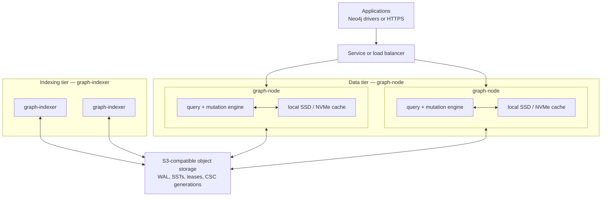

# HydraDB

[](https://github.com/hydra-db/hydradb/actions/workflows/container.yml)
[](https://github.com/hydra-db/hydradb/actions/workflows/opencypher-tck.yml)
[](LICENSE)
[](rust-toolchain.toml)
[](https://hydra-db.github.io/benchmark/)

HydraDB is an object-store-native distributed graph database written in Rust.
It combines durable graph storage on SlateDB with snapshot-consistent
OpenCypher queries, GraphBLAS traversal, Neo4j-compatible Bolt connectivity,
and an HTTPS query API.

Storage and compute are fully disaggregated. S3-compatible object storage is the
durable source of truth, and compute runs as two independent roles: **data
nodes** (`graph-node`) serve queries and canonical mutations, while **indexers**
(`graph-indexer`) build immutable traversal indexes in the background. Both keep
only disposable state in memory and on local SSD or NVMe, so they can be replaced
or scaled without moving the graph itself.

## Why HydraDB

- **Object-store durability.** Graph records, WALs, manifests, and immutable
  traversal indexes live in S3-compatible storage.
- **Independent compute.** Data nodes and indexers scale separately and can
  rebuild their local caches from durable state.
- **Safe writer handoff.** Object-store CAS leases select the active writer for
  each cell, while SlateDB writer epochs fence stale writers.
- **Consistent reads.** Every query runs against one pinned SlateDB snapshot.
  Indexed traversal combines a compiled CSC generation with its visible WAL
  overlay.
- **Graph-native execution.** The planner uses property indexes, reverse
  adjacency, sparse traversal, and SuiteSparse GraphBLAS where appropriate.
- **Familiar clients.** Applications can use Neo4j drivers over Bolt 5.x or the
  typed JSON and streaming NDJSON HTTP API.
- **Bounded operation.** Authentication, authorization, deadlines, result
  limits, backpressure, cancellation, cache budgets, metrics, and traces are
  part of the server runtime.

## Architecture



Each data node owns a private local SSD/NVMe cache; the object store is the shared
layer beneath the whole tier and the only durable copy of the graph.

Data nodes serve reads and canonical graph mutations. Indexer workers build
immutable CSC generations asynchronously and publish them through atomic
object-store pointers. Readers remain correct when an index is absent or behind
because the visible WAL tail is applied to the indexed base.

See [architecture.md](architecture.md) for the storage model, query pipeline,
writer coordination, index lifecycle, and failure semantics.

## Getting Started

There are two ways to bring up a single development node: the published **Docker
image**, or a **build from source**. Either way, once the node is listening, use
[Verify a running node](#verify-a-running-node) to confirm it works — a listening
port is not proof; a round-tripped write is. TLS is required by default in
deployed environments, so the local flows below enable plaintext explicitly.

<details>
<summary><strong>Run with Docker</strong> — fastest, no local toolchain</summary>

Release images are published to
[`ghcr.io/hydra-db/hydradb`](https://github.com/hydra-db/hydradb/pkgs/container/hydradb).
Each `v*` release is tagged with its full version, compatible minor and major
versions, the commit SHA, and `latest` (for example `0.1.0`, `0.1`, `0`,
`latest`, `sha-7bf77ac`):

```bash
docker pull ghcr.io/hydra-db/hydradb:latest
```

Images are published for `linux/amd64` and `linux/arm64`, so Docker selects the
right one for the host and Apple Silicon needs no extra flags. Releases up to
and including `0.1.0` were `linux/amd64` only, and pulling one of those on an
ARM host fails with:

```
no matching manifest for linux/arm64/v8 in the manifest list entries
```

That message means the tag predates multi-architecture publishing, not that the
pull is misconfigured. Move to a release after `0.1.0`, or run the older tag
under emulation with `--platform linux/amd64` — correct but slower, and it
requires Rosetta on Apple Silicon. To see which architectures a tag actually
carries before pulling it:

```bash
docker buildx imagetools inspect ghcr.io/hydra-db/hydradb:latest
```

This starts one plaintext node backed by a host directory mounted into the
container:

```bash
mkdir -p hydradb-data/store hydradb-data/cache
printf '%s\n' 'local-development-token-32-bytes' > hydradb-data/auth-token

docker run --rm \
  --user "$(id -u):$(id -g)" \
  -p 7687:7687 -p 8443:8443 -p 9090:9090 \
  -v "$PWD/hydradb-data:/data" \
  -e CLOUD_PROVIDER=local \
  -e LOCAL_PATH=/data/store \
  -e GRAPH_NAMESPACE=default \
  -e GRAPH_ID=default \
  -e GRAPH_CELL_ID=cell-0 \
  -e GRAPH_CELLS=cell-0 \
  -e GRAPH_NODE_ID=node-0 \
  -e GRAPH_BOLT_NODE_ADDRESSES=node-0=127.0.0.1:7687 \
  -e GRAPH_ADVERTISED_BOLT_ADDR=127.0.0.1:7687 \
  -e GRAPH_DATA_CACHE_DIR=/data/cache \
  -e GRAPH_AUTH_TOKEN_FILE=/data/auth-token \
  -e GRAPH_ALLOW_PLAINTEXT=true \
  -e RUST_MIN_STACK=33554432 \
  ghcr.io/hydra-db/hydradb:latest
```

The node runs in the foreground. `LOCAL_PATH` must point at a directory that
already exists, which is why `hydradb-data/store` is created before the mount.
`--user "$(id -u):$(id -g)"` is required: the image runs as UID/GID `10001`,
but the bind-mounted `hydradb-data` is owned by the host user, so without it the
container cannot write its store or cache and fails on the first storage
operation. Running as the host user makes the mounted directories writable and
keeps the created files host-owned. The image entrypoint is `graph-node`; it
also ships `graph-indexer`. For production, pin an image digest rather than
`latest` — see the [Helm chart guide](charts/hydradb/README.md).

> **`CLOUD_PROVIDER=local` is for smoke tests, not sustained writes.** The
> `local` backend stores through `LocalFileSystem`, which does not implement
> conditional puts (`put_opts` with `PutMode::Update`). Manifest garbage
> collection needs them, so under a sustained write load GC begins failing and
> does not recover — logged at `ERROR` as
> `error collecting garbage [resource=Manifest, error=ObjectStoreError(NotImplemented ...)]`.
> Reads and `/readyz` keep succeeding while this happens, so the node looks
> healthy. For anything beyond a smoke test, point the node at an S3-compatible
> object store instead — `CLOUD_PROVIDER=aws` with `AWS_BUCKET_NAME`,
> `AWS_DEFAULT_REGION`, and, for a local MinIO, `AWS_ENDPOINT` plus
> `AWS_ALLOW_HTTP=true`. `CLOUD_PROVIDER` accepts `local`, `memory`, `aws`,
> `azure` and `gcp`; `memory` is also fine for a throwaway smoke test where
> durability does not matter. See the
> [Helm chart guide](charts/hydradb/README.md) for the full object-store surface,
> and [#81](https://github.com/hydra-db/hydradb/issues/81) for the reproduction.

</details>

<details>
<summary><strong>Build from source</strong> — for development and the full recipe surface</summary>

#### Prerequisites

HydraDB requires Rust 1.91 or newer, a C/C++ toolchain,
`libcypher-parser`, and SuiteSparse GraphBLAS.

Ubuntu or WSL:

```bash
sudo apt-get update
sudo apt-get install -y \
  build-essential clang libclang-dev cmake pkg-config \
  libcypher-parser-dev libgraphblas-dev \
  curl git python3 python3-venv
```

The last line is not needed to build, but the steps below use it: `curl` for
the Rust installer and the readiness checks, `git` to clone, and `python3-venv`
for the Neo4j driver used by `scripts/runtime_smoke.sh`.

macOS with Homebrew:

```bash
xcode-select --install
brew install just cmake pkg-config llvm suite-sparse
brew install cleishm/neo4j/libcypher-parser

# Rust, only if `rustup toolchain list` does not already show a stable toolchain:
curl --proto '=https' --tlsv1.2 -sSf https://sh.rustup.rs | sh
```

`libcypher-parser` is not in homebrew-core; the fully-qualified
`cleishm/neo4j/...` name adds the tap automatically. A plain
`brew install libcypher-parser` fails with `No available formula`.

Rust comes from the official installer rather than Homebrew because the
`rustup` formula is keg-only and no longer ships a `rustup-init` binary, so
`brew install rustup` leaves nothing named `rustup` on `PATH`.
`rust-toolchain.toml` pins `channel = "stable"`, so any rustup-managed stable
toolchain works.

No `PKG_CONFIG_PATH` export is needed: `libcypher-parser` is not keg-only, so
Homebrew links `cypher-parser.pc` into the default `pkg-config` search path.

[`just`](https://github.com/casey/just) is the supported command runner for the
repository. Install it with `cargo install just --locked` when your package
manager does not provide it. Docker is optional and is used only by MinIO,
Neo4j comparison, image-build, and Kubernetes harnesses.

#### Clone and verify

```bash
git clone https://github.com/hydra-db/hydradb.git
cd hydradb

just native-check
just smoke
```

The smoke example creates a local graph, writes and deletes edges, runs a sparse
traversal, closes the database, reopens it, and verifies the durable result.
The recipe creates and removes an isolated local object-store directory. Use
`just smoke-graphblas` to pin the traversal kernel to SuiteSparse GraphBLAS.

To exercise the same flow against an ephemeral MinIO instance:

```bash
just minio-smoke
```

#### Run a local server

The following starts a single plaintext development node backed by a local
directory.

```bash
mkdir -p .hydradb/store .hydradb/cache
printf '%s\n' 'local-development-token-32-bytes' > .hydradb/auth-token

export CLOUD_PROVIDER=local
export LOCAL_PATH="$PWD/.hydradb/store"
export GRAPH_NAMESPACE=default
export GRAPH_ID=default
export GRAPH_CELL_ID=cell-0
export GRAPH_CELLS=cell-0
export GRAPH_NODE_ID=node-0
export GRAPH_BOLT_NODE_ADDRESSES=node-0=127.0.0.1:7687
export GRAPH_ADVERTISED_BOLT_ADDR=127.0.0.1:7687
export GRAPH_DATA_CACHE_DIR="$PWD/.hydradb/cache"
export GRAPH_AUTH_TOKEN_FILE="$PWD/.hydradb/auth-token"
export GRAPH_ALLOW_PLAINTEXT=true

# graph-node's async query futures exceed the default thread stack. Without
# this the node builds, serves /readyz, and then aborts on the first query.
export RUST_MIN_STACK=33554432

# macOS: cargo is invoked directly here, so it does not inherit what the
# justfile exports. Linux installs these on default search paths already.
if command -v brew >/dev/null; then
  export BINDGEN_EXTRA_CLANG_ARGS="-I$(brew --prefix)/include"
  export LIBRARY_PATH="$(brew --prefix)/lib"
fi

cargo run --locked --features server-runtime --bin graph-node
```

The node runs in the foreground and does not return; that is it working, not
hanging. Confirm it from a second shell with
[Verify a running node](#verify-a-running-node).

For a fully scripted Bolt and HTTP round trip against a source build, install the
Python Neo4j driver and run. Homebrew's and Debian's Python both refuse a bare
`pip install` under PEP 668, so use a virtualenv (`apt-get install -y
python3-venv` on Debian/Ubuntu):

```bash
python3 -m venv /tmp/hydradb-venv && /tmp/hydradb-venv/bin/pip install neo4j

# macOS: this script calls cargo directly, so it does not inherit what the
# justfile exports. Without this it fails at bindgen with
# `'cypher-parser.h' file not found`. Linux needs neither.
if command -v brew >/dev/null; then
  export BINDGEN_EXTRA_CLANG_ARGS="-I$(brew --prefix)/include"
  export LIBRARY_PATH="$(brew --prefix)/lib"
fi

PYTHON=/tmp/hydradb-venv/bin/python bash scripts/runtime_smoke.sh
```

Prints `runtime-smoke-ok`. The node's log is at
`/tmp/sgk-runtime-smoke/node.log`; read it first if the script fails.

</details>

### Verify a running node

However you started it, the node listens on:

| Endpoint | Address | Purpose |
|---|---|---|
| Bolt | `127.0.0.1:7687` | Neo4j-driver-compatible queries |
| HTTP | `127.0.0.1:8443` | JSON and NDJSON query API |
| Admin | `127.0.0.1:9090` | readiness and Prometheus metrics |

In another terminal, write and read a small graph through HTTP:

```bash
TOKEN='local-development-token-32-bytes'

curl -sS http://127.0.0.1:8443/v1/graphs/default/query \
  -H "Authorization: Bearer $TOKEN" \
  -H 'X-Graph-Namespace: default' \
  -H 'Content-Type: application/json' \
  --data '{"cell_id":"cell-0","query":"CREATE (a {id: 1})-[:FOLLOWS]->(b {id: 2})"}'

curl -sS http://127.0.0.1:8443/v1/graphs/default/query \
  -H "Authorization: Bearer $TOKEN" \
  -H 'X-Graph-Namespace: default' \
  -H 'Content-Type: application/json' \
  --data '{"cell_id":"cell-0","query":"MATCH (a {id: 1})-[:FOLLOWS]->(b) RETURN b.id AS id"}'
```

The second call returns one row containing
`{"type":"vertex_id","value":2}`. A listening port is not proof the node works;
a round-tripped write is.

<details>
<summary><strong>Troubleshooting local runs</strong></summary>

| Symptom | Cause and fix |
|---|---|
| `No available formula with the name "libcypher-parser"` | Use the tap: `brew install cleishm/neo4j/libcypher-parser` |
| `command not found: rustup-init` | Homebrew's `rustup` is keg-only and no longer ships it; use the official installer above |
| `invalid environment variable CLOUD_PROVIDER value \`null\`` | `CLOUD_PROVIDER` is unset — `null` means absent, not the string. `local` also needs `LOCAL_PATH`, pointing at a directory that already exists |
| `wrapper.h:4:10: fatal error: 'cypher-parser.h' file not found` | `BINDGEN_EXTRA_CLANG_ARGS` unset while invoking `cargo` directly on macOS. Prefer `just`, which exports it |
| Node answers `/readyz`, then aborts with `has overflowed its stack` on the first query | `RUST_MIN_STACK` unset; export `33554432` |
| `curl: (7) Failed to connect ... port 9090` | The node is not running. `graph-node` holds the foreground, so start it in its own shell |

</details>

Agents working in this repository should read [AGENTS.md](AGENTS.md), which
carries the same sequence plus repository conventions and failure modes.
Contributors building HydraDB should also read [DEVELOPMENT.md](DEVELOPMENT.md)
for the full recipe, harness, and script surface.

## Querying

HydraDB supports a practical OpenCypher subset for graph reads and mutations,
including typed relationships, bounded variable-length paths, property and
label predicates, ordering, pagination, aggregation, `OPTIONAL MATCH`, `UNION`,
and batched `UNWIND` writes.

Applications can connect with a Neo4j driver using a routed URI:

```text
neo4j://127.0.0.1:7687
```

Use `neo4j+s://` with a publicly trusted certificate or `neo4j+ssc://` for a
self-signed development certificate. Direct `bolt://` node addresses are for
diagnostics and targeted failure tests; write-capable clustered clients should
use routing.

### Native path procedures

HydraDB includes native snapshot-scoped path procedures:

- `algo.SPpaths` finds bounded paths between one source and one target.
- `algo.SSpaths` finds bounded paths from one source.
- `algo.MSpaths` resolves many indexed source and target values and evaluates
  them together, avoiding client-side query fan-out.

```cypher
CALL algo.MSpaths({
  sourceLabel: 'Entity',
  sourceProperty: 'name',
  sourceValues: ['alpha', 'beta', 'gamma'],
  targetValues: ['alpha', 'beta', 'gamma'],
  pairwise: true,
  relTypes: ['RELATES'],
  relDirection: 'both',
  maxLen: 3,
  pathCount: 5,
  fairRelationshipVariants: true,
  resultLimit: 100
})
YIELD path
RETURN path
```

The procedures use one pinned storage snapshot, compiled GraphBLAS topology
when available, the visible WAL overlay, and bounded metadata hydration.

## Read Consistency

HydraDB exposes two read modes:

| Mode | Behavior |
|---|---|
| `causal` | Uses the node's current durable reader view and refreshes when a supplied bookmark requires a newer sequence. This is the default hot path. |
| `strong` | Refreshes the SlateDB reader from object storage before pinning the query snapshot. This pays the object-store freshness cost. |

HTTPS requests set `"consistency": "causal"` or `"strong"` in the request
body. Bolt clients set `consistency` in `RUN` metadata or
`hydradb.consistency` in transaction metadata.

## Kubernetes

The Helm chart deploys query nodes, indexer workers, services, cache volumes,
network policies, disruption budgets, TLS resources, authentication, and
optional Prometheus integration.

```bash
helm upgrade --install hydradb charts/hydradb \
  --namespace hydradb \
  --create-namespace \
  --values charts/hydradb/examples/values-eks.yaml \
  --atomic \
  --timeout 15m
```

Copy and edit the example values before deploying. Object-store credentials,
bucket names, image references, TLS, advertised Bolt addresses, and workload
identity are environment-specific. See the [Helm chart guide](charts/hydradb/README.md)
for configuration and rollout details.

## Observability

The public HTTP server exposes `GET /healthz`. The graph-node and indexer admin
servers expose:

```text
GET /readyz
GET /metrics
```

The runtime emits structured tracing fields for query fingerprints, access
paths, cache outcomes, consistency mode, scope, cell, storage sequence, and
planner decisions. Build with `--features server-runtime,otlp` or
`--features indexer-runtime,otlp` to export OpenTelemetry data.

Prometheus duration histograms have deliberately different units. Read
[docs/runbooks/duration-histograms.md](docs/runbooks/duration-histograms.md)
before building latency dashboards or alerts.

## Development

Run `just` or `just help` to list the command surface. Recipes use Bash and run
from the repository root; the full native suite requires `libcypher-parser` and
SuiteSparse GraphBLAS. [DEVELOPMENT.md](DEVELOPMENT.md) documents the complete
surface — verification recipes, local and MinIO harnesses, and the standalone
scripts. Run `just ci` before opening a pull request.

### Repository layout

```text
src/core/           configuration, graph model, cache policy, errors
src/shard/          storage lifecycle, reads, writes, queries, path procedures
src/engine/         routing, placement, immutable indexes, index GC
src/query/          OpenCypher parsing, algebra, planning, transport types
src/client/         Bolt, HTTP, authentication, quotas, cursors
src/sparse_kernel/  Rust sparse and SuiteSparse GraphBLAS execution
crates/             placement and telemetry workspace crates
charts/hydradb/    Kubernetes Helm chart
examples/           smoke, import, benchmark, and correctness programs
scripts/            local, MinIO, stress, fencing, and deployment harnesses
docs/               architecture notes, runbooks, benchmarks, and verification
```

## Benchmarks

Published latency and throughput results are available on the
[HydraDB benchmark site](https://hydra-db.github.io/benchmark/). To reproduce
measurements locally or against S3, use the benchmark commands and scripts
documented above.


## Documentation

| Document | Contents |
|---|---|
| [Architecture](architecture.md) | End-to-end design, snapshots, writer ownership, query execution, and indexing |
| [Helm chart guide](charts/hydradb/README.md) | Kubernetes configuration, TLS, authentication, upgrades, and verification |
| [Duration histograms](docs/runbooks/duration-histograms.md) | Correct latency units, PromQL, aggregation, and alerting |
| [Correctness casebook](docs/bugs-found-fixed/README.md) | Reproduced storage and query invariants with regression evidence |
| [Formal verification](docs/formal-methods/0003-hydradb-quint-verification-evidence.md) | Quint and model-based testing evidence |
| [Jepsen report](docs/jepsen/jepsen-consistency-report.md) | Distributed consistency test results |

## Contributing

Issues and pull requests are welcome. Keep changes focused, add regression
coverage for behavioral changes, and run `just ci` before opening a pull
request. Changes to storage, fencing, snapshots, routing, or index publication
should state the invariant they preserve and include a failure-oriented test.

## License

HydraDB is licensed under the [GNU Affero General Public License v3.0](LICENSE).
