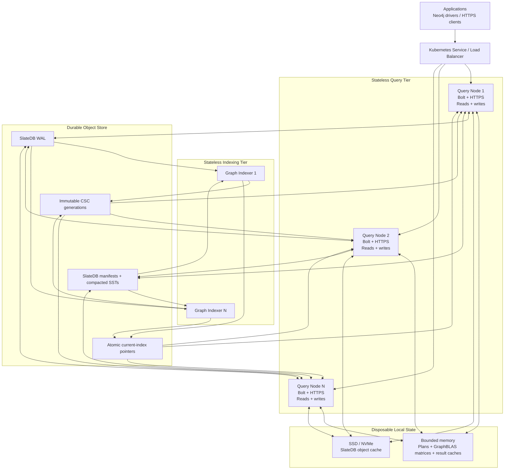
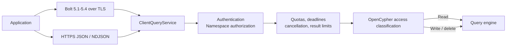
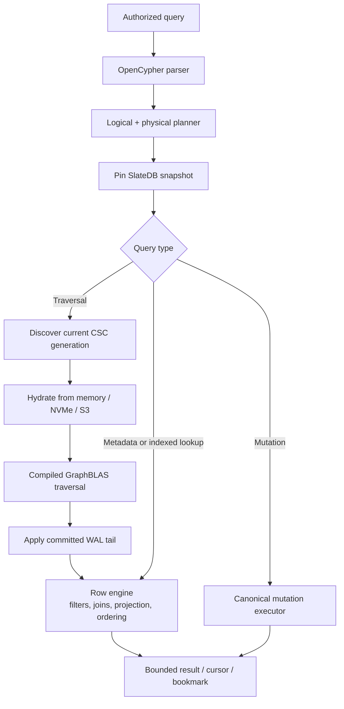
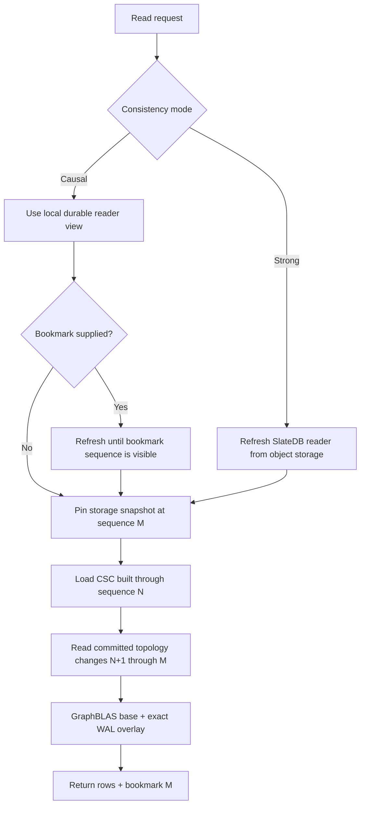
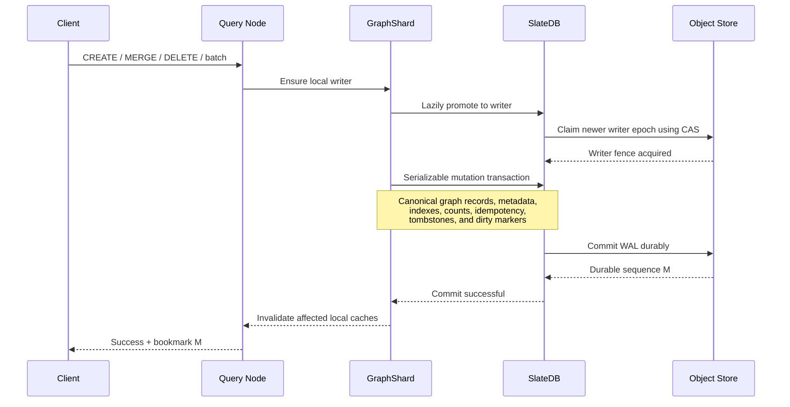
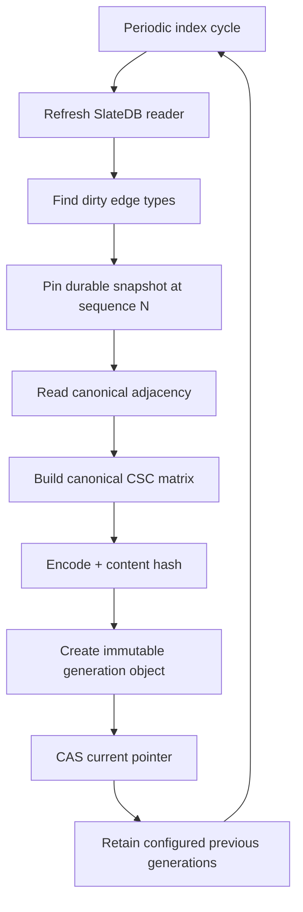
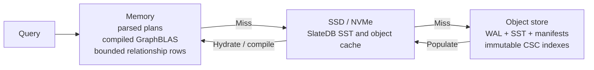
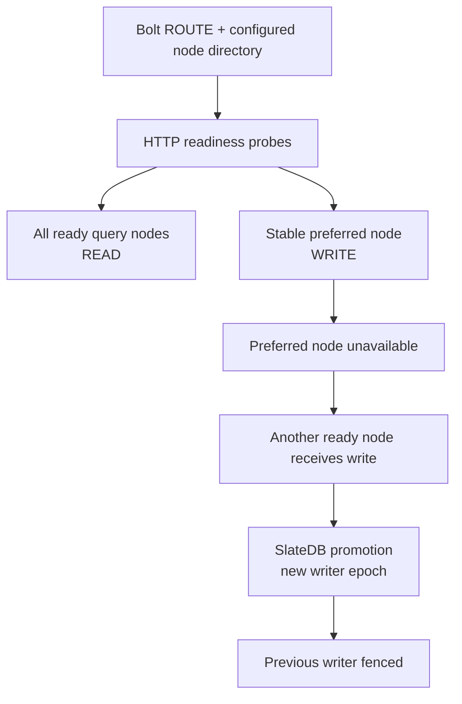

# Turbolay Architecture

Turbolay is a Rust graph database built on SlateDB. S3-compatible object
storage is the durable source of truth. Query and indexing processes are
stateless with respect to durable graph state; their memory and SSD/NVMe data
are disposable caches.

SlateDB owns writer fencing, commit ordering, WAL durability, storage
snapshots, compaction, and object-store coordination. Turbolay owns the graph
model, canonical graph records, query planning, OpenCypher execution,
content-addressed graph indexes, GraphBLAS traversal, public protocols, and
operational limits.

## Design Invariants

- Every namespace, graph, and cell has one active SlateDB writer and any number
  of SlateDB readers.
- Every ready query node can serve reads for every configured cell.
- Every promotable query node can receive a write; SlateDB's writer epoch and
  WAL barrier decide which writer may commit.
- A preferred writer address is cache affinity, not correctness authority.
- Every query pins one SlateDB storage snapshot.
- Canonical graph records remain correct without a graph index.
- Graph indexes are immutable, asynchronous, and reconstructible.
- Local memory and SSD/NVMe loss affects latency, not durability.
- No writable graph controller or separate consensus database is in the data
  path.

## High-Level Architecture



The architecture separates live request processing from expensive index
construction. Query nodes serve public reads and canonical writes. Indexers
independently build sparse traversal indexes and publish them to object
storage. Both tiers can be replaced or scaled without moving durable graph
state.

## Client And Protocol Layer



The shared client service performs the following work before a request reaches
the graph engine:

1. Authenticate the Bolt or HTTPS session.
2. Resolve and authorize the namespace, graph, and cell scope.
3. Classify the OpenCypher statement as read or write before authorization.
4. Validate parameters and supported bounded batch forms.
5. Enforce global and namespace concurrency, query size, runtime, page, and
   result-memory limits.
6. Validate bookmarks and apply the requested read-consistency mode.
7. Create a scoped cancellation token and execute the request.
8. Return bounded rows, a server-side cursor when needed, and a durable
   sequence bookmark.

Bolt supports Neo4j-driver-compatible auto-commit `RUN`, `PULL`, `DISCARD`,
`RESET`, `GOODBYE`, and `ROUTE`. Explicit cross-query transactions remain
unsupported until their semantics can be guaranteed.

## Query Node Internals



Each query uses exactly one `DbSnapshot` or `DbReaderSnapshot`. Canonical graph
records, metadata, indexes, tombstones, and idempotency state are therefore
evaluated at one durable SlateDB storage sequence.

Suitable sparse traversals use the compiled GraphBLAS path. The row engine
handles metadata predicates, relationship identity and properties, ordering,
projection, aggregation, pagination, and query forms that do not map to the
sparse kernel.

## Read Consistency And Index Overlay

Turbolay exposes two read-consistency modes.



### Causal reads

Causal is the default low-latency mode. It uses the node's current durable
reader view. Without a bookmark it performs no mandatory object-store freshness
check. With a bookmark, the reader refreshes until it can observe at least the
bookmark's storage sequence.

### Strong reads

Strong mode refreshes the SlateDB reader from object storage before pinning the
query snapshot. It observes durable writes committed before that refresh
completed and intentionally pays the object-store freshness cost.

### Indexed base plus WAL tail

An index generation built at sequence `N` remains usable for a query pinned at
sequence `M`. The engine reads affected topology records from the committed WAL
range `N+1..M`, resolves their final state from the same pinned snapshot, and
overlays those changes on the immutable CSC base. A query therefore does not
need to wait for the next indexing cycle to observe recent committed writes.

If the necessary WAL tail has already been compacted away, correctness falls
back to bounded source-scoped canonical reads rather than returning stale
results.

## Write And Delete Path



Writes, deletes, detach deletes, relationship mutations, imports, and supported
batch operations all use the same writer-fenced path. Successful API return
means the mutation has reached SlateDB's durable commit point.

If another query node obtains a newer SlateDB writer epoch, the previous writer
is fenced and cannot commit. The stale node closes its writer handle and may
continue serving reads through `DbReader`.

`CREATE` intentionally creates new graph entities and is not inherently safe
to retry after an ambiguous client response. Retriable production mutations
should use stable-ID `MERGE` forms or explicit idempotency keys.

## Indexer Architecture



Indexer workers have no client query listener and never become graph writers.
They:

1. Refresh their SlateDB readers.
2. Discover edge types marked dirty by canonical mutations.
3. Pin a durable snapshot and materialize canonical adjacency.
4. Encode one canonical compressed-sparse-column matrix.
5. Derive a content hash and create an immutable generation object.
6. Atomically advance the small `current` pointer with object-store CAS.
7. Garbage-collect older generations while retaining the configured rollback
   window.

Multiple indexers may inspect the same dirty work. Duplicate computation is
possible, but content-addressed objects and CAS publication prevent current
index regression. Indexer outage increases WAL-tail work but does not block
canonical reads or writes.

## Cache And Storage Hierarchy



| Tier | Contents | Durable |
| --- | --- | --- |
| Memory | Parsed row queries, compiled GraphBLAS matrices, generation metadata, and bounded relationship-result caches | No |
| SSD/NVMe | SlateDB object and SST cache plus hydrated object data | No |
| Object store | SlateDB WAL, manifests, compacted SSTs, immutable CSC generations, and current pointers | Yes |

Memory caches are bounded by entry counts and resident-byte limits. Oversized
results remain correct but are not retained. Losing a query-node Pod, memory
cache, or cache volume changes cold-start latency only.

## Namespace And Object-Store Layout

```text
<base>/
+-- _graph_scopes/v1/<graph-id>/<root-namespace>/
    +-- <encoded-tenant>/<encoded-subtenant>/__scope__
+-- namespaces/<tenant>/
    +-- subnamespaces/<subtenant>/...
        +-- graphs/<graph-id>/
            +-- <cell-id>/
                +-- SlateDB manifests
                +-- SlateDB WAL
                +-- SlateDB compacted SSTs
                +-- _graph_index/
                    +-- <cell-id>/<edge-type>/
                        +-- current
                        +-- generations/
                            +-- <sequence>-<content-hash>.csc
```

The namespace hierarchy supports a tenant plus up to seven nested
subnamespaces. A graph is selected within that namespace path, and each cell is
opened as an independent SlateDB database under the graph. Consequently, every
`(namespace path, graph, cell)` has independent WAL, snapshots, writer fencing,
indexes, and cache locality.

Bolt adapters select these scopes with a versioned database name:
`<base-database>.scope1.<base64url-tenant>.<base64url-subtenant>`. The encoded
components themselves are the storage-safe child namespace IDs; `_` denotes an
absent subtenant. This mapping is deterministic and collision-free for opaque
UTF-8 tenant and collection identifiers. Query nodes lazily open a bounded
number of scopes, while immutable `__scope__` markers let indexers discover
them with object-store LIST operations and no writable catalog service.

Canonical graph keys are records inside SlateDB WAL/SST data. They include
outbound topology, segment data and tombstones, vertex and relationship
metadata, property indexes, degree/count records, idempotency state, and cell
lifecycle markers. They are not emitted as one S3 object per graph record.

## Multi-Node Routing And Failover



Kubernetes or static runtime configuration supplies node membership. Readiness
probes determine which addresses Bolt may advertise. Every ready node is a read
candidate; one stable address is preferred for writes to preserve writer and
cache locality.

There is no controller or external leader-election service. Failover is
request-driven: rendezvous placement selects a contender, which must win a
server-timestamped object-store CAS lease before it may open the SlateDB writer.
The lease is renewed while the writer is held and lease loss closes that handle.
SlateDB's writer epoch and WAL barrier remain the final split-writer protection.

## Authority Boundaries

| Concern | Authoritative component |
| --- | --- |
| Durable graph state | SlateDB data in object storage |
| Writer admission | Object-store CAS lease scoped by graph and cell |
| Final writer fencing | SlateDB writer epoch and WAL barrier |
| Query snapshot | Query-scoped SlateDB snapshot |
| Causal position | SlateDB durable sequence bookmark |
| Latest traversal index | Object-store CAS `current` pointer |
| Canonical graph correctness | SlateDB graph records plus tombstones |
| Node membership | Kubernetes or configured static directory |
| Node eligibility | Runtime readiness probe |
| Preferred writer | Bolt routing hint only |
| Memory and NVMe state | Disposable performance cache only |

In compact form, Turbolay is:

```text
stateless query compute
        +
stateless indexing compute
        +
disposable memory and NVMe caches
        +
SlateDB single-writer / multi-reader storage
        +
S3 durability, CAS, and shared ground truth
```
