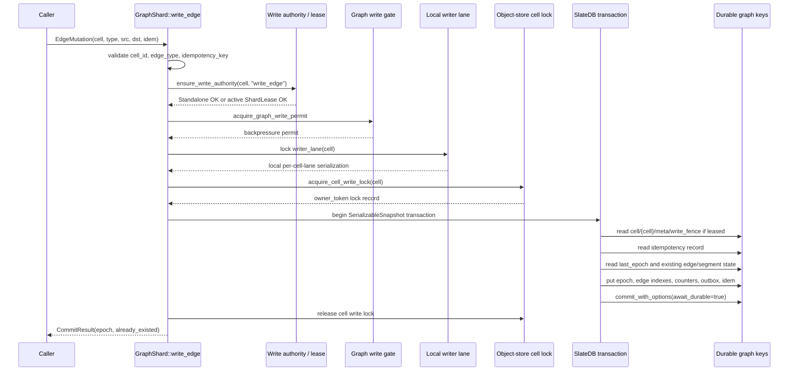
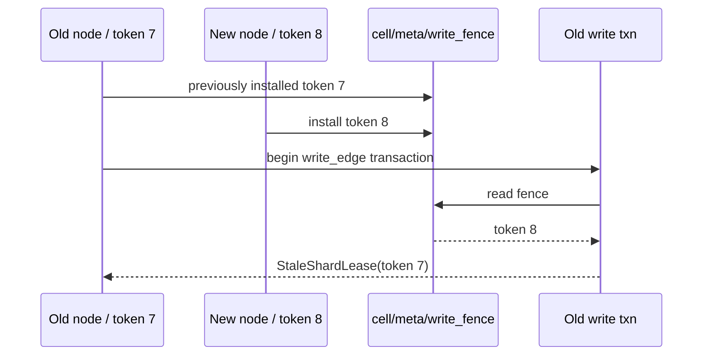
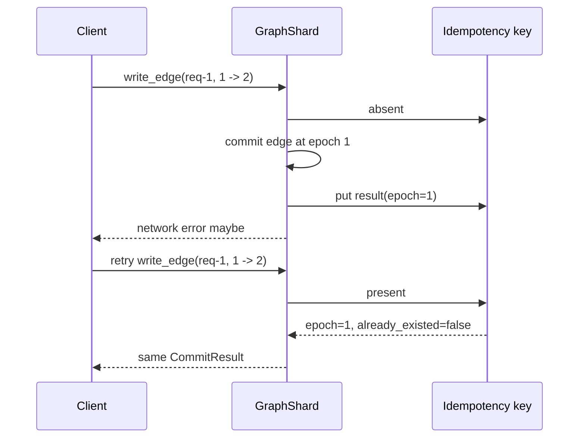
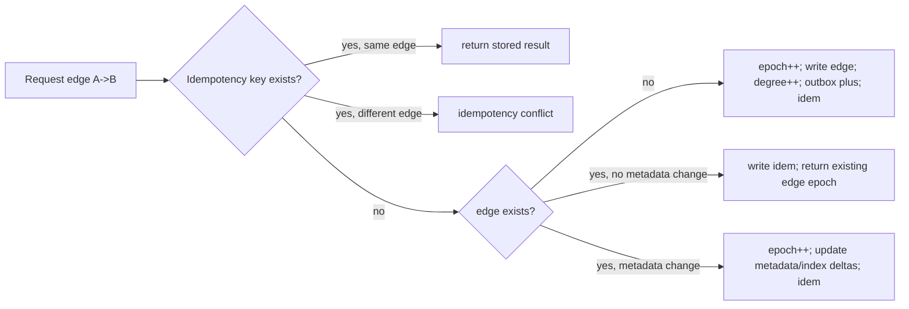

# Chapter: The `write_edge` Write Path

This chapter explains the edge-write path centered on
`src/shard/write.rs:195`:

```rust
pub async fn write_edge(&self, mutation: EdgeMutation) -> Result<CommitResult>
```

A write is not just “put an edge”. It is a guarded transaction that checks local
write authority, cross-process fencing, idempotency, epoch allocation, adjacency
indexes, degree counters, and outbox deltas.

---

## 1. The public input and output

`write_edge` takes an `EdgeMutation` from `src/core/model.rs`:

```rust
pub struct EdgeMutation {
    pub cell_id: String,
    pub edge_type: String,
    pub src: VertexId,
    pub dst: VertexId,
    pub idempotency_key: String,
}
```

It returns:

```rust
pub struct CommitResult {
    pub epoch: GraphEpoch,
    pub already_existed: bool,
}
```

Meaning:

- `epoch` is the graph epoch at which this logical write is visible.
- `already_existed` is `true` when the edge was already present before this
  request.
- `idempotency_key` makes retrying safe. Replaying the same request with the
  same key returns the original result. Reusing the key for a different edge is
  rejected by the idempotency decoder.

---

## 2. Bird’s-eye sequence



The layers are deliberately redundant:

1. **Local authority** rejects read-only or stale leased writers before doing
   work.
2. **Graph write gate** applies backpressure.
3. **Local writer lane** serializes concurrent writes inside this process for
   the same hashed cell lane.
4. **Object-store cell lock** serializes writers across processes.
5. **SlateDB serializable transaction** gives atomic key updates and retryable
   conflict detection.
6. **Data write fence** prevents a stale leased node from writing after a newer
   lease has taken over.

---

## 3. The three “lease / lock / fence” concepts

They sound similar, but they solve different problems.

```mermaid
flowchart TB
    subgraph ControlPlane[Control-plane ownership]
        P[Placement says cell belongs to node]
        SL[ShardLease\ncell_id, owner_node_id, lease_token, expires_at_ms]
        P --> SL
    end

    subgraph LocalProcess[Local GraphShard process]
        WA[GraphWriteAuthority]
        A[active_write_lease]
        WA --> A
    end

    subgraph DataPlane[Data-plane protection]
        F[cell/{cell}/meta/write_fence\nowner_node_id + lease_token]
        CL[__slatedb_graph_kernel/write_locks/.../{cell}\nowner_token + TTL + state]
    end

    SL --> WA
    A --> F
    A --> CL

    F -->|stops stale lease token| TXN[write transaction]
    CL -->|serializes processes| TXN
```

### 3.1 `ShardLease`: control-plane ownership

Defined in `src/engine.rs`, a `ShardLease` is:

```rust
pub struct ShardLease {
    pub cell_id: String,
    pub owner_node_id: String,
    pub lease_token: u64,
    pub expires_at_ms: u64,
}
```

A routed `GraphNode` obtains/renews this lease through the control plane. The
lease token increases when ownership is reacquired. Renewals keep the same token
but extend `expires_at_ms`.

### 3.2 `GraphWriteAuthority`: local permission to attempt writes

`GraphShard` can be opened as:

- `ReadOnly` via `GraphShard::open(...)` — writes fail.
- `Standalone` via `open_standalone_writer(...)` — no lease/fence required.
- `Leased` via the routed cluster — requires a live local `ShardLease`.

`write_edge` calls:

```rust
self.ensure_write_authority(&mutation.cell_id, "write_edge")?;
```

For a leased shard, this checks:

- there is a lease for the cell;
- the lease owner equals the local node id;
- `expires_at_ms > now`.

If not, the write returns `WriteRequiresLease` or `StaleShardLease` before
opening the data transaction.

### 3.3 Data write fence: durable stale-writer guard

Before a leased writer can write data, it installs:

```text
cell/{cell_id}/meta/write_fence
```

with the current `owner_node_id` and `lease_token`.

Every leased write transaction calls `validate_write_fence_txn(...)` inside the
same SlateDB transaction. The transaction proceeds only if the durable fence
matches the local active lease.

Why this matters:

- A node can have an old in-memory lease view.
- Another node can acquire a newer lease token and install a newer fence.
- The stale node must not be able to commit data even if it still reaches the
  object store.



### 3.4 Cell write lock: cross-process mutex

`acquire_cell_write_lock` writes an object-store lock record at:

```text
__slatedb_graph_kernel/write_locks/{db_path}/{cell_id}
```

It uses `PutMode::Create`. So only one process can create the active lock. If
the object already exists, the writer reads it:

- if it is active and unexpired, wait/backoff and retry;
- if it is released or expired, reclaim it with conditional `PutMode::Update`
  using the object version / ETag.

Constants from `src/lib.rs`:

```rust
GRAPH_TXN_MAX_RETRIES = 32
GRAPH_CELL_WRITE_LOCK_MAX_ATTEMPTS = 256
GRAPH_CELL_WRITE_LOCK_BACKOFF_MS = 2
GRAPH_CELL_WRITE_LOCK_TTL_MS = 5 * 60 * 1000
```

On normal exit the lock is updated to `state=released`. If releasing fails after
a successful commit, the caller may see an error even though the transaction is
already durable; idempotency makes retry safe.

---

## 4. Step-by-step through `write_edge`

Source: `src/shard/write.rs:195-229`.

```mermaid
flowchart TD
    A[write_edge(mutation)] --> B[validate cell_id, edge_type, idempotency_key]
    B --> C[ensure_write_authority]
    C --> D[acquire_graph_write_permit]
    D --> E[lock writer_lane(cell_id)]
    E --> F{attempt < 32}
    F --> G[write_edge_txn]
    G -->|retryable SlateDB txn conflict or cell lock conflict| H[increment write_retries; yield]
    H --> F
    G -->|StaleShardLease| I[increment stale_write_rejects; return error]
    G -->|Ok| J[increment write_commits; return CommitResult]
    G -->|other error| K[return error]
```

### 4.1 Validation

`validate_component` rejects invalid path components for:

- `cell_id`
- `edge_type`
- `idempotency_key`

These values are interpolated into object-store keys, so they must be safe.

### 4.2 Local authority check

`ensure_write_authority` protects the public API from accidental writes on a
read shard and from stale leased writers.

### 4.3 Backpressure

`acquire_graph_write_permit` uses `graph_write_gate`. The default policy allows
one concurrent graph write, but this is configurable through
`GraphBackpressurePolicy`.

### 4.4 Local writer lane

`writer_lane(cell_id).lock().await` maps the cell id to one of 64 mutex lanes.
This is not the distributed lock. It just avoids unnecessary same-process races
for related cells.

### 4.5 Retry loop

Retryable errors are:

- SlateDB transaction conflicts;
- `CellWriteConflict` from the object-store cell lock.

The retry loop yields and retries up to 32 attempts.

---

## 5. The transaction wrapper

Source: `src/shard/write.rs:231-237`.

```rust
let lock = self.acquire_cell_write_lock(&mutation.cell_id, "write_edge").await?;
let result = self.write_edge_txn_locked(mutation).await;
release_cell_write_lock(lock, result).await
```

Important ordering:

1. Acquire the cross-process object-store lock.
2. Run the SlateDB transaction body.
3. Release the lock, preserving the original transaction error if any.

The lock is outside SlateDB. The actual graph keys are still committed through
SlateDB.

---

## 6. The transaction body

Source: `src/shard/write.rs:394-575`.

```mermaid
flowchart TD
    A[begin SerializableSnapshot txn] --> B[validate durable write fence]
    B --> C[build idem key: cell/{cell}/idem/create/{idempotency_key}]
    C --> D{idem record exists?}
    D -->|yes| E[decode and return original CommitResult]
    D -->|no| F[read current_epoch from cell/{cell}/meta/last_epoch]
    F --> G[check existing edge at current_epoch]
    G --> H[read and merge requested vertex metadata]
    H --> I[read and merge requested edge metadata]
    I --> J{edge already exists?}
    J -->|yes and no metadata changed| K[write idem only; commit; return existing epoch]
    J -->|yes and metadata changed| L[allocate next epoch; update metadata; write idem; commit]
    J -->|no| M[allocate next epoch]
    M --> N[write last_epoch]
    N --> O[write metadata updates if any]
    O --> P[write out edge]
    P --> Q[write reverse in edge if enabled]
    Q --> R[increment degree counters]
    R --> S[write outbox plus delta]
    S --> T[write idempotency record]
    T --> U[commit durable]
```

### 6.1 Serializable transaction

The transaction begins with:

```rust
self.db.begin(IsolationLevel::SerializableSnapshot).await?
```

Reads use `read_txn_remote`, which marks the key as read for conflict tracking
and reads with remote durability filtering.

### 6.2 Fence check inside the transaction

For standalone writers, `validate_write_fence_txn` returns immediately. For
leased writers, it reads:

```text
cell/{cell_id}/meta/write_fence
```

and requires the fence to match the active local `ShardLease`.

This check is inside the same serializable transaction as the graph mutation, so
a competing fence update can cause the stale writer to fail instead of silently
committing.

### 6.3 Idempotency check

The create idempotency key is:

```text
cell/{cell_id}/idem/create/{idempotency_key}
```

If present, the value is decoded and validated against the incoming mutation.
That gives exactly-once retry behavior for clients:



### 6.4 Epoch allocation

The current epoch is read from:

```text
cell/{cell_id}/meta/last_epoch
```

If the write is a new edge, the transaction writes `last_epoch = current + 1`.
That epoch becomes the visibility timestamp of the edge and outbox delta.

### 6.5 Existing-edge detection

The transaction checks whether the edge already exists at `current_epoch` using
`edge_epoch_at_txn`. This checks:

1. the canonical out-edge key;
2. trusted segment append artifacts for the same source;
3. segment tombstones, so deleted segment edges do not count as visible.

This avoids double-counting degree counters when an edge already exists.

### 6.6 Metadata merge path

Plain `write_edge` passes no vertex metadata and empty edge metadata. The shared
implementation also powers:

- `write_edge_with_vertex_metadata`
- `write_edge_with_full_metadata`

If metadata changes, the transaction writes:

- latest vertex or edge metadata;
- metadata delta by epoch;
- label/property index entries;
- label/property index delta entries.

For an already-existing edge:

- no adjacency edge is written again;
- no degree is incremented;
- no edge outbox delta is emitted;
- metadata changes can still advance `last_epoch`.

---

## 7. Keys written for a brand-new edge

For this call:

```rust
write_edge(EdgeMutation {
    cell_id: "reddit-home".into(),
    edge_type: "USER_FOLLOWS_USER".into(),
    src: 1,
    dst: 2,
    idempotency_key: "req-1".into(),
})
```

A first successful write at epoch `1` writes keys shaped like:

```text
cell/reddit-home/
├── meta/
│   └── last_epoch                         = 1
├── e/
│   ├── out/USER_FOLLOWS_USER/00000000000000000001/00000000000000000002
│   │      = EdgeRecord(cell, type, src=1, dst=2, epoch=1)
│   └── in/USER_FOLLOWS_USER/00000000000000000002/00000000000000000001
│          = EdgeRecord(...)       # only when GraphIndexPolicy writes reverse index
├── cnt/
│   ├── out/USER_FOLLOWS_USER/00000000000000000001 = 1
│   └── in/USER_FOLLOWS_USER/00000000000000000002  = 1  # if reverse index enabled
├── outbox/
│   └── 00000000000000000001/plus/USER_FOLLOWS_USER/00000000000000000001/00000000000000000002
│          = DeltaRecord::Plus(edge)
└── idem/
    └── create/req-1
           = CommitResult(epoch=1, already_existed=false) bound to this edge identity
```

If this is a leased writer, the transaction also reads but does not rewrite:

```text
cell/reddit-home/meta/write_fence
```

The cross-process lock lives outside the graph keyspace:

```text
__slatedb_graph_kernel/write_locks/{db_path}/reddit-home
```

---

## 8. New edge vs duplicate edge



Plain `write_edge` normally has no metadata change, so a duplicate edge with a
new idempotency key returns the existing epoch and does not increment degree.

---

## 9. Durability model

Graph writers are required to use durable commits. `open_internal` rejects
write-authoritative shards when `await_durable_writes` is disabled, because the
writer releases cross-process fences only after writing remote-visible metadata
such as:

- `last_epoch`
- degree counters
- idempotency keys

The commit path is:

```rust
txn.commit_with_options(&WriteOptions { await_durable, ..Default::default() })
```

Default `GraphDurabilityConfig` sets `await_durable_writes = true`.

---

## 10. Failure and retry matrix

| Failure point | Behavior |
|---|---|
| Invalid component | immediate validation error |
| Read-only shard | `WriteRequiresLease` |
| Leased shard missing/expired local lease | `WriteRequiresLease` or `StaleShardLease` |
| Durable fence differs from local lease | `StaleShardLease` |
| Cell lock held by active writer | retry, then `CellWriteConflict` |
| SlateDB transaction conflict | retry up to `GRAPH_TXN_MAX_RETRIES` |
| Commit succeeds but response is lost | client retries idempotency key and gets same result |
| Commit succeeds but lock release fails | caller may see error; retry is safe through idempotency |

---

## 11. Mental model

The write path can be remembered as:

```text
validate request
→ prove this process may write this cell
→ take local backpressure + lane locks
→ take cross-process cell lock
→ begin serializable transaction
→ prove the durable data fence matches this lease
→ replay idempotency if already done
→ allocate next epoch only if needed
→ write adjacency/index/counter/outbox/idempotency keys atomically
→ durable commit
→ release cell lock
```

The central invariant is:

> For each cell, every committed edge mutation is assigned a monotonic epoch and
> all visibility keys for that mutation become durable atomically, while stale
> leased writers and duplicate client retries are rejected or replayed safely.
